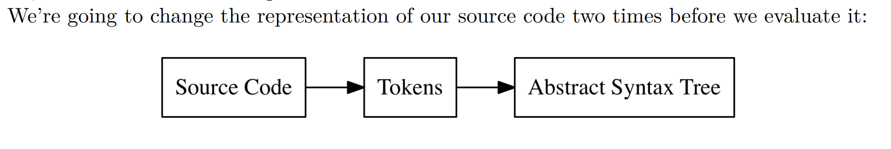

# Building a Tree-Walking Interpreter

## Build our own Lexer, Parser, Tree Representation, and Evaluator

Expressed as a list of features, Monkey has the following:
- C-like syntax
- variable bindings
- integers and booleans
- arithmetic expressions
- built-in functions
- first-class and higher-order functions
- closures
- a string data structure
- an array data structure
- a hash data structure

```js
let age = 1;
let name = "Monkey";
let result = 10 * (20 / 2);

//binding an array of integers to a name
let myArray = [1, 2, 3, 4, 5];
myArray[0] // => 1

//And here is a hash, where values are associated with keys:
let thorsten = {"name": "Thorsten", "age": 28};
thorsten["name"] // => "Thorsten"

let add = fn(a, b) { return a + b; };
let add = fn(a, b) { a + b; }; //we can leave out the return if we want to

//recursive fibonacci
let fibonacci = fn(x) {
    if (x == 0) {
        0
    } else {
        if (x == 1) {
            1
        } else {
            fibonacci(x - 1) + fibonacci(x - 2);
        }
    }
};

// higher order functions (functions that take other functions as arguments)
let twice = fn(f, x) {
    return f(f(x));
};

let addTwo = fn(x) {
    return x + 2;
};

twice(addTwo, 2); // => 6
```

Our interpreter will have a few major parts
- the lexer
- the parser
- the Abstract Syntax Tree (AST)
- the internal object system
- the evaluator

## Chapter 1.1: Lexical Analysis



The first transformation from source code to tokens, is called `lexical analysis` or `lexing`. It is done by a lexer (aka tokenizer or scanner). Tokens themselves are small & easily categorizable data structures that are then fed to the parser, which does the second transformation to turn tokens into an "Abstract Syntax Tree".

For example: 

```js
"let x = 5 + 5;" 
```
when put into the lexer will generate:
```js
[
    LET,
    IDENTIFIER("x"),
    EQUAL_SIGN,
    INTEGER(5),
    PLUS_SIGN,
    INTEGER(5),
    SEMICOLON
]
```

Note: whitespace length is not converted to tokens, and are ignored. 

## 1.2 - Defining Our Tokens

```js
let five = 5;
let ten = 10;
let add = fn(x, y) {
    x + y;
};

let result = add(five, ten);
```
This example contains numbers like 5 and 10 which will be a `integer token`. Then we have the variable names `x`, `y`, and `words`. as well as assignment / functions `let` and `fn`. 

In the lexer or parser we dont care if the number is 5 or 10, we just want to know if its a number. The same goes for `variable names`, we will call them `identifiers` and treat them the same. The ones that look like identifiers, but aren't really identifiers since they're apart of the language will be called `keywords`. 

We will not group them together because it **should** make a diff in the parsing stage whether we encounter a `let` or `fn`. Finally we will categorize special characters separately, since it matters if we have a `{` or `}` in the source code. 

Lets define our `Token` data structure. we need a `type` attribute to differentiate between `integers` and `right bracket` for example. And it needs a field that holds the literal value of the token so we can reuse it later. 

```go
// token/token.go
package token

type TokenType string

type Token struct {
    Type TokenType
    Literal string
}

const (
    ILLEGAL = "ILLEGAL" //unrecognized tokens
    EOF = "EOF" // end of file
    // Identifiers + literals
    IDENT = "IDENT" // add, foobar, x, y, ...
    INT = "INT" // 1343456
    // Operators
    ASSIGN = "="
    PLUS = "+"
    // Delimiters
    COMMA = ","
    SEMICOLON = ";"
    LPAREN = "("
    RPAREN = ")"
    LBRACE = "{"
    RBRACE = "}"
    // Keywords
    FUNCTION = "FUNCTION"
    LET = "LET"
)
```

## 1.3 - The Lexer 

The lexer will take source code and input and output tokens that represent the source code. It will go through its input and output the next token it recognizes. It doesn't need to buffer or save tokens, since there will only be one method called `NextToken()` which will output the next token. 

We will initialize the lexer with our source code and then repeatedly call `NextToken()` on it to go through the source code, token by token, character by character. 

lets start with our constructor

```go
// lexer/lexer.go
package lexer

type Lexer struct {
    input string
    position int // current position in input (points to current char)
    readPosition int // current reading position in input (after current char)
    ch byte // current char under examination
}

func New(input string) *Lexer {
    l := &Lexer{input: input}
    return l
}
```

`readPosition` and `position` will be used as two "pointers" pointing to our 
input string as an index (i.e. `l.input[l.readPosition]`). The reason we need two is because `readPosition` will allow us to "peek" furtner into the input to tell us what the future characters are. 

```go
// lexer/lexer.go
func (l *Lexer) readChar() { // give us next character and advance our position in the input string
    if l.readPosition >= len(l.input) { // checks if we have reached the end of the input
        l.ch = 0 // 0 is ASCII for the "NUL" character used to denote "EOF" or "unitialized"
    } else {
        l.ch = l.input[l.readPosition]
    }
    l.position = l.readPosition
    l.readPosition += 1
}
```

Next, we will implement the `NextToken()` method. We will look at the current character under examination (l.ch) and return a token depending on which character it is. Before returning the token we advance our pointers as we go. A small helper function `newToken()` will initialize tokens. 

```go
// lexer/lexer.go
package lexer
import "monkey/token"
func (l *Lexer) NextToken() token.Token {
    var tok token.Token
    switch l.ch {
    case '=':
        tok = newToken(token.ASSIGN, l.ch)
    case ';':
        tok = newToken(token.SEMICOLON, l.ch)
    case '(':
        tok = newToken(token.LPAREN, l.ch)
    case ')':
        tok = newToken(token.RPAREN, l.ch)
    case ',':
        tok = newToken(token.COMMA, l.ch)
    case '+':
        tok = newToken(token.PLUS, l.ch)
    case '{':
        tok = newToken(token.LBRACE, l.ch)
    case '}':
        tok = newToken(token.RBRACE, l.ch)
    case 0:
        tok.Literal = ""
        tok.Type = token.EOF
    }
    l.readChar()
    return tok
}

func newToken(tokenType token.TokenType, ch byte) token.Token {
    return token.Token{Type: tokenType, Literal: string(ch)}
}
```

To process `Identifiers` and `Keywords` we need to recognize if the current `ch` is a letter and if so, keep reading the rest of the token until its a non-letter character. Once we have read the entire kw/identifier, we need to identify which one it is and use the corresponding `token.TokenType`.

```go
// lexer/lexer.go
import "monkey/token"
func (l *Lexer) NextToken() token.Token {
    var tok token.Token
    switch l.ch {
        // [...]
        default:
        if isLetter(l.ch) {
            tok.Literal = l.readIdentifier()
            return tok
        } else {
            tok = newToken(token.ILLEGAL, l.ch)
        }
    }
    // [...]
 }
func (l *Lexer) readIdentifier() string {
    position := l.position
    for isLetter(l.ch) {
        l.readChar()
    }
    return l.input[position:l.position]
}

func (l *Lexer) readNumber() string {
    position := l.position
    for isDigit(l.ch) {
        l.readChar()
    }
    return l.input[position:l.position]
}

func isLetter(ch byte) bool {
    return 'a' <= ch && ch <= 'z' || 'A' <= ch && ch <= 'Z' || ch == '_'
}
```

We add a default branch to our switch statement so that we can check for identifiers whenever `l.ch` is not one of our recognized characters. the `readIdentifier()` function reads an identifier and advances our lexer's positions until it encounters a non-letter character. 

next to identify whether its a keyword or identifier we can create a function `LookupIdent()` to check the keywords table to see if its an identifier or keyword.

```go
// token/token.go
var keywords = map[string]TokenType{
    "fn": FUNCTION,
    "let": LET,
}
func LookupIdent(ident string) TokenType {
    if tok, ok := keywords[ident]; ok {
        return tok
    }
    return IDENT
}
```

We also add a couple of helper statements: Primarily `isLetter()` `skipWhitespace()` and `isDigit()`. `readNumber()` is basically readIdentifier but we use isDigit instead of isLetter. 

## 1.4 Expanding our token set and lexer

Support for: ==, !, !=, -, /, *, <, > and the keywords true, false, if, else and return.

These can be categorized as:
- one-char token (eg '-')
- two-char token (eg '==')
- kw token (eg 'return')

Next, added constants and keywords to `token/token.go` and extend our switch statement in `lexer/lexer.go`. To add support for two-char tokens we can extend branches (look ahead to see if we return something diff) for our `!` and `=` operators. We will do this by implementing `peekChar()` which is similar to readChar except it doesnt increment our position counters. 

```go
// lexer/lexer.go
func (l *Lexer) peekChar() byte { 
    if l.readPosition >= len(l.input) {
        return 0
    } else {
        return l.input[l.readPosition]
    }
}

func (l *Lexer) NextToken() token.Token {
    // [...]
    switch l.ch {
    case '=':
        if l.peekChar() == '=' {
            ch := l.ch
            l.readChar()
            literal := string(ch) + string(l.ch)
            tok = token.Token{Type: token.EQ, Literal: literal}
        } else {
            tok = newToken(token.ASSIGN, l.ch)
        }
        // [...]
    case '!':
        if l.peekChar() == '=' {
            ch := l.ch
            l.readChar()
            literal := string(ch) + string(l.ch)
            tok = token.Token{Type: token.NOT_EQ, Literal: literal}
        } else {
            tok = newToken(token.BANG, l.ch)
        }
    // [...]
}
```

Note that we save l.ch in a local variable before calling l.readChar() again. This way we don’t lose the current character and can safely advance the lexer so it leaves the NextToken() with l.position and l.readPosition in the correct state.
